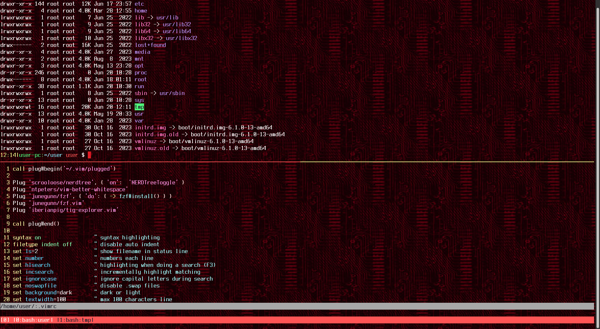
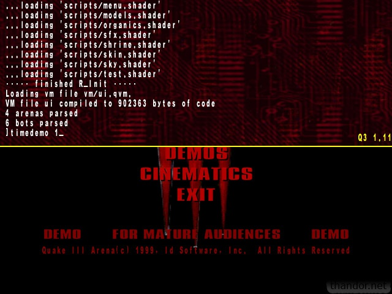

<div align="center">

</div>

## quake3-terminal-theme
A stupid attempt to implement a ```Quake III Arena``` console ```theme``` in my terminal. I still
love this game. Unfortunately, I couldn't find the font used in the Quake console :( I tried to
recreate something similar in my ```xfce4-terminal```. I use ```Bash```, ```Vim```, ```Tmux```
tools, so I made color changes in them. Here's what came out of it:



What are we talking about:


## Installation
```
$ umask 022
$ cp .vimrc ~/
$ cp .tmux.conf ~/
$ cp .dircolors ~/
$ sudo apt-get install xfonts-terminus
$ cp terminalrc ~/.config/xfce4/terminal/
$ sudo mkdir /usr/share/quake3-background
$ sudo cp 280x280.tga /usr/share/quake3-background
$ echo "PS1='\[\e[0;33m\]\A|\[\e[0;32m\]\h:\[\e[0;36m\]\w \[\033[0;31m\]\u\[\e[0m\] \$ '" >> ~/.bashrc
```
Restart terminal.

## Useful resources
https://www.quake3world.com/forum/viewtopic.php?f=7&t=51371

https://github.com/nrempel/q3-server/tree/master/baseq3
